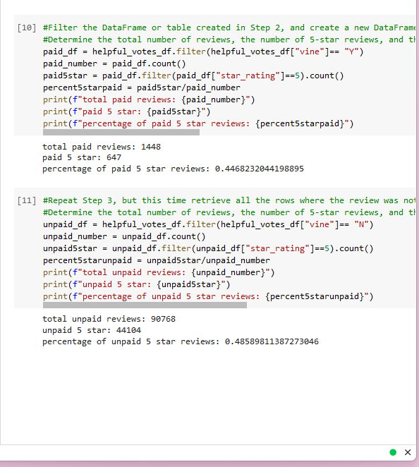

# Amazon_Vine_Analysis
# Overview of the analysis:
This module introduced us to big data and how it's handled.  According to the module in canvas, "Data is considered big data when it exceeds the capacity of operational databases."  There are also various technologies for handling big data.  In this module, we learned about Apache Hadoop (Hadoop), an open source framework composed of three parts known as Hadoop Distributed File System (HDFS), MapReduce, and Yet Another Resource Negotiator (YARN).  MapReduce is an important process because it distributes and processes large data on a cluster via mapping and reducing.  Usually, data gets converted into key-value pairs during the mapping stage.  However, Hadoop is difficult to set up and not right for this project.  Therefore, we were introduced to a python library called MapReduce Job (mrjob) to practice MapReduce outside the Hadoop ecosystem. PySpark, a natural language processing (NLP) was also used to carry out the ETL process of extracting the dataset, transforming the data, connecting to Amazon Web Services (AWS) RDS instance, and loading the transformed data into pgAdmin.

## *purpose :*
The purpose of this analysis was to determine if there is any bias towards reviews that were written as part of the Vine program by determining if having a paid Vine review makes a difference in the percentage of 5-star reviews.

# Results: 
This analysis was part of deliverable 2 and it was conducted using PySpark and the extracted home dataset from the Amazon Review database including the paid Amazon Vine program. 

Figure 1.

As seen in Figure 1:
There was a total of 1448 paid reviews and a total of 90768 unpaid reviews. 
There were also 647 paid 5-star reviews and 44104 unpaid 5 star reviews.  
This made up 45% of paid 5-star reviews and 49% of unpaid 5 star reviews. 

# Summary: 
Overall, the results are a bit unclear to me because there is a large difference between the totals for paid and unpaid reviews.  One could say the data is somewhat skewed.  As a result, it cannot be determined if there is a bias towards reviews that were written as part of the Vine program because it cannot be determined if having a paid vine review makes a difference in the percentage of 5-star reviews.  I would recommend having more reviews before making making an assessment. 

